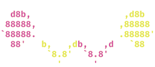
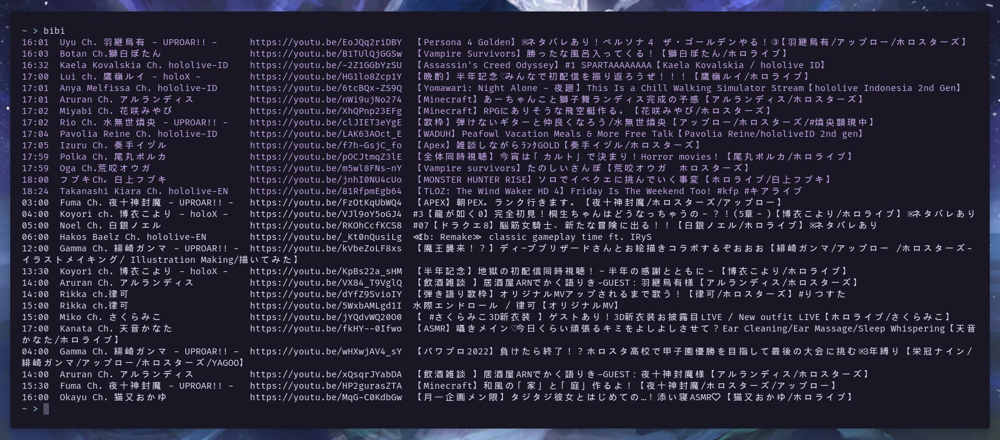

<div align="top"></div>
<br />
<div align="center">



### Bibi

A simple Hololive Stream Schedule CLI tool.

[Features](#features)
•
[Usage](#usage)
•
[Installation](#installation)
•
[Configuration](#configuration)
•
[Uninstallation](#uninstallation)

</div>

## Features

- View the schedules of Hololive members
- Configurable

## Usage

Simply running `bibi` without any arguments will print the current and upcoming streams.



For help, run `bibi -h`.

```
A simple Hololive Schedule CLI tool.
Shows current and upcoming streams if no flags are provided.

Usage: bibi [OPTIONS]

Options:
  -a, --all              Show all streams
      --ascii            Print a cute Bibi ascii art
  -c, --config <PATH>    Config path
  -f, --format <FORMAT>  Output format
  -l, --live             Show streams that are currently live
  -e, --ended            Show streams that have ended
  -u, --upcoming         Show streams that have not started yet
  -h, --help             Print help information
  -V, --version          Print version information
```

## Installation

### Manual installation

1. Install Rust
2. Clone the repository

   ```sh
   git clone https://github.com/myuwi/bibi-cli.git && cd bibi-cli
   ```

3. Build

   ```sh
   cargo build --release
   ```

4. Copy the `bibi` executable to the `/usr/local/bin` directory.

   ```sh
   sudo install -Dsm755 target/release/bibi -t /usr/local/bin
   ```

### Using the Justfile

| Recipe    | Description                |
| --------- | ---------------------------|
| list      | List available commands    |
| build     | Build Bibi in release mode |
| clean     | Clean build artifacts      |
| install   | Build and Install Bibi     |
| uninstall | Uninstall Bibi             |

## Configuration

Bibi will look for a config file at following locations: `$XDG_CONFIG_HOME/bibi/bibi.toml` or `$HOME/.config/bibi/bibi.toml`

### Example configuration file

```toml
[branches]
hololive = true   # Show Hololive members?
holostars = false # Show Holostars members?

[channels]
# Specific channels to exclude (overrides branch options)
exclude = ["@hololive"]
include = ["@astelleda"]
```

## Uninstallation

To uninstall Bibi, you can simply just run the following command:

```sh
sudo rm -f "$(which bibi)"
```

## Why the name "Bibi"?

From the [Hololive fan wiki][towa-wiki]: "The hat she ([Tokoyami Towa][towa-yt]) has on is actually her pet Bibi (ビビ), a guardian and protector given to her by her mother in order to look after her during her studies."

[_Go listen to Towa's music_][towa-music]

<p align="right"><a href="#top">back to top</a></p>

[towa-wiki]: https://hololive.wiki/wiki/Tokoyami_Towa
[towa-yt]: https://www.youtube.com/channel/UC1uv2Oq6kNxgATlCiez59hw
[towa-music]: https://youtu.be/HBmss54l5zc
